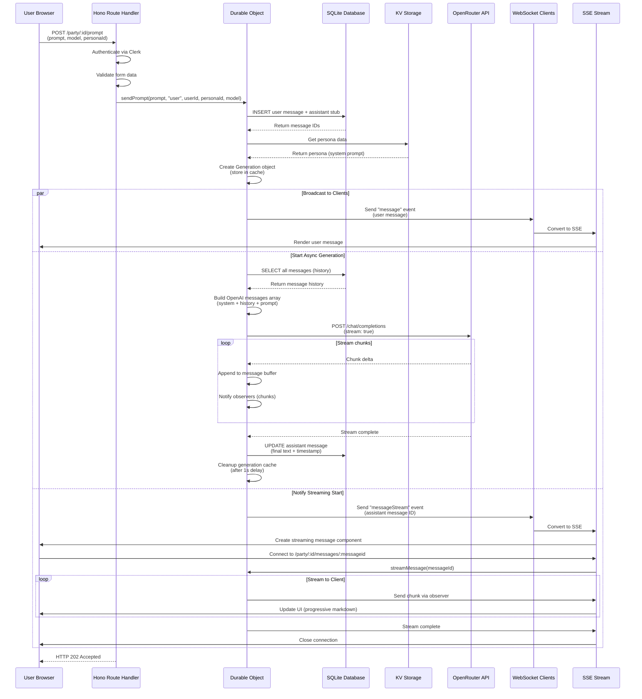

# Prompt Flow Documentation

## Overview

When a user sends a prompt via the `/party/:id/prompt` endpoint, the system processes the message asynchronously, stores it in the database, triggers an AI generation, and streams the response back to all connected clients in real-time.

## Flow Summary

### 1. Request Handling (`/party/:id/prompt`)

The Hono route handler:
- **Authenticates** the user via Clerk middleware
- **Validates** form data (prompt, model, personaId)
- **Retrieves** user information from Clerk
- **Calls** the Durable Object's `sendPrompt` method
- **Returns** HTTP 202 (Accepted) immediately

### 2. Message Storage & Generation Setup

The Durable Object (`MyDurableObject.sendPrompt`):
- **Inserts two messages** into SQLite:
  - User message with the prompt text
  - Assistant message stub (null message, will be filled during generation)
- **Creates a Generation object** to manage the streaming response
- **Stores the generation** in memory cache (keyed by message ID)
- **Loads persona data** from KV storage (for system prompt)

### 3. Real-time Notification

The Durable Object immediately:
- **Broadcasts to all WebSocket clients**:
  - User message notification (`type: "message"`)
  - Assistant streaming notification (`type: "messageStream"` with message ID)
- These WebSocket messages are converted to SSE events by the `/party/:id/messages` endpoint

### 4. Asynchronous AI Generation

The generation process runs asynchronously (fire-and-forget):
- **Builds message history** from SQLite (all previous messages)
- **Constructs OpenAI API request**:
  - System prompt from persona (or default)
  - Full conversation history
  - New user prompt
- **Streams response chunks** from OpenRouter API
- **Notifies observers** (clients streaming this specific message) as chunks arrive
- **Updates SQLite** with final complete message when generation finishes
- **Cleans up** generation cache after 1 second delay

### 5. Client-Side Streaming

Clients receive updates via Server-Sent Events (SSE):
- **Initial connection** (`/party/:id/messages`) receives all message notifications
- **Streaming connection** (`/party/:id/messages/:messageid`) receives chunks for specific messages
- **UI updates** in real-time as chunks arrive
- **Message component** renders markdown progressively using `<streaming-md>` web component

## Key Components

- **Hono Route Handler**: HTTP request/response handling, authentication
- **Durable Object**: Stateful coordination, WebSocket management, SQLite persistence
- **Generation Class**: Manages streaming AI responses with observer pattern
- **SSE Endpoints**: Convert WebSocket messages to SSE for htmx compatibility
- **Message Component**: React component that renders messages and handles streaming

## Sequence Diagram

## Important Design Decisions

1. **Asynchronous Processing**: The route handler returns immediately (202) while generation happens in the background, providing better user experience.

2. **Dual Message Insert**: Two messages are inserted upfront - the user message and an assistant stub. This allows clients to start rendering the assistant message immediately while streaming.

3. **Observer Pattern**: The `Generation` class uses an observer pattern to notify multiple clients streaming the same message simultaneously.

4. **WebSocket to SSE Conversion**: WebSocket messages from the Durable Object are converted to SSE events by the `/party/:id/messages` endpoint, enabling htmx compatibility.

5. **Streaming Architecture**: Two-level streaming:
   - High-level: `/party/:id/messages` for message notifications
   - Low-level: `/party/:id/messages/:messageid` for individual message chunks

6. **Persistence Strategy**: Messages are stored in SQLite for durability, while active generations are cached in memory for low-latency streaming.

